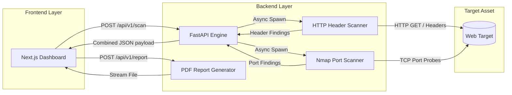

<div align="center">

# 🛡️ SurfaceCheck

**Automated Vulnerability Scanning & Attack Surface Evaluation Platform**

[](https://www.python.org/)
[](https://fastapi.tiangolo.com/)
[](https://nextjs.org/)
[](https://www.typescriptlang.org/)
[](https://tailwindcss.com/)
[](https://nmap.org/)

<p align="center">
  Instantly audit web targets for missing HTTP security headers and exposed network ports.<br>
  Get plain-English explanations, real-time scoring, and professional PDF reports in seconds.
</p>

</div>

---

## 🌟 Why SurfaceCheck?

Traditional vulnerability scanners output dense, technical jargon that leaves non-technical stakeholders and developers confused. **SurfaceCheck** bridges the gap between offensive cybersecurity and intuitive product design. It orchestrates high-speed asynchronous scans and translates complex security risks into **clear, plain-English remediation steps** accessible to anyone.

### ✨ Key Highlights

| Feature | Description |
| :--- | :--- |
| **🚀 Parallel Asynchronous Scanning** | Runs Nmap TCP port analysis and HTTP security header inspections concurrently using Python `asyncio` for blazing-fast results. |
| **🧠 Plain-English Explanations** | Translates complex vulnerabilities (like Clickjacking or MIME-sniffing) into simple analogies with step-by-step developer fixes. |
| **📊 Dynamic Security Score** | Calculates a weighted security score (0–100) presented with an animated ring gauge and clear severity grading. |
| **📄 Professional PDF Reports** | Generates clean, executive-ready PDF documents summarising scan results, severity breakdowns, and passed checks. |
| **🎨 Cyber-Themed UI/UX** | Built with Next.js & Tailwind CSS v4, featuring dark mode glassmorphism, animated radar sweeps, and micro-animations. |

---

## 🏗️ System Architecture

SurfaceCheck operates on a decoupled client-server architecture, communicating via REST APIs.



---

## 🛠️ Technology Stack

| Layer | Technologies & Libraries | Purpose |
| :--- | :--- | :--- |
| **Backend API** | Python 3.10+, FastAPI, Uvicorn, Pydantic | High-performance async REST API and data validation |
| **Security Engine** | `python-nmap`, `requests`, `socket` | Network TCP scanning and HTTP header analysis |
| **Reporting** | `fpdf2` | Dynamic, professional PDF document generation |
| **Frontend** | Next.js 16 (App Router), React, TypeScript | Interactive user dashboard and client logic |
| **Styling & UI** | Tailwind CSS v4, Custom CSS Keyframes | Modern glassmorphism, glowing borders, and animations |

---

## 🚀 Getting Started

Follow these instructions to run SurfaceCheck locally on your machine.

### Prerequisites

> [!IMPORTANT]
> **Nmap System Tool Required:** The backend port scanner requires the underlying Nmap binary installed and accessible in your system `PATH`.
> - **Windows:** Download from [nmap.org](https://nmap.org/download.html) (Ensure *"Add Nmap to system PATH"* is checked during setup).
> - **macOS:** `brew install nmap`
> - **Linux:** `sudo apt-get install nmap`

You also need **Python 3.10+** and **Node.js 18+** installed.

### 1️⃣ Start the Backend API

Open a terminal and navigate to the backend folder:

```powershell
# Navigate to backend
cd vuln-scanner-backend

# Create virtual environment
python -m venv venv

# Activate virtual environment (Windows)
.\venv\Scripts\activate
# (macOS/Linux: source venv/bin/activate)

# Install dependencies
pip install fastapi uvicorn pydantic requests python-nmap fpdf2

# Start the API server
uvicorn main:app --reload
```
*The FastAPI server will start at `http://127.0.0.1:8000`. Interactive API docs are available at `http://127.0.0.1:8000/docs`.*

### 2️⃣ Start the Frontend Dashboard

Open a **new terminal window** and start the web UI:

```powershell
# Navigate to frontend
cd surfacecheck-frontend

# Install dependencies
npm install

# Start development server
npm run dev
```
*Open [http://localhost:3000](http://localhost:3000) in your browser to launch the SurfaceCheck dashboard.*

---

## 🎯 Safe Testing Targets

> [!WARNING]
> **Do not scan targets without authorization.** Use the following authorized or controlled environments to verify your scanners:

| Target URL | Purpose | Expected Findings |
| :--- | :--- | :--- |
| `http://scanme.nmap.org` | Official Nmap test server | Port scanning detection |
| `http://testphp.vulnweb.com` | Acunetix vulnerable web app | Missing HTTP security headers |
| `http://127.0.0.1` | Your local development machine | Local service exposure |

---

## 🛡️ Scanned Vulnerabilities & Checks

<details>
<summary><b>Click to expand the full list of security checks performed</b></summary>

<br>

#### 🌐 HTTP Security Headers
* **Strict-Transport-Security (HSTS):** Ensures browsers connect exclusively via HTTPS to prevent protocol downgrade and eavesdropping attacks.
* **Content-Security-Policy (CSP):** Mitigates Cross-Site Scripting (XSS) and data injection by restricting authorized script origins.
* **X-Frame-Options:** Blocks unauthorized framing to protect users against Clickjacking attacks.
* **X-Content-Type-Options:** Prevents MIME-sniffing vulnerabilities by enforcing server-declared content types.

#### 🔌 TCP Network Ports
* **Port 21 (FTP):** Checks for unencrypted file transfer services vulnerable to credential sniffing.
* **Port 22 (SSH):** Identifies public remote administration ports susceptible to automated brute-force attacks.
* **Port 23 (Telnet):** Flags critical unencrypted legacy remote login protocols.
* **Port 3306 (MySQL):** Detects exposed database servers open to public networks.
* **Port 3389 (RDP):** Audits public Remote Desktop endpoints frequently targeted for unauthorized access.

</details>

---

## ⚠️ Disclaimer

> [!CAUTION]
> **For educational and authorized testing purposes only.** Always obtain explicit, written permission from asset owners prior to conducting security assessments. The developers and contributors of SurfaceCheck assume no liability and are not responsible for any misuse, damage, or legal consequences caused by the use of this software.

---

<div align="center">
  <p>Built with ❤️ using Python & Next.js</p>
</div>
